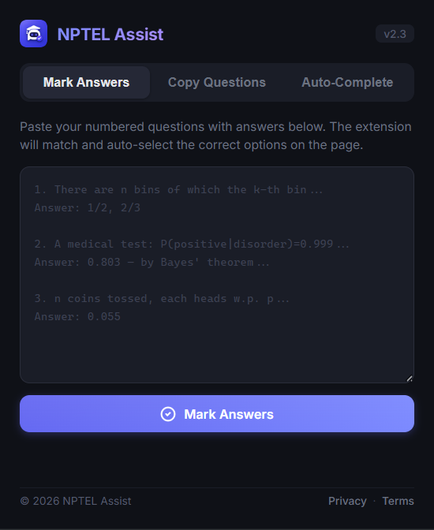

# NPTEL Assist

<p align="center">
  
</p>

<p align="center">
  A Chrome extension for <a href="https://nptel.ac.in">NPTEL</a> / <a href="https://swayam.gov.in">Swayam</a> that marks answers, extracts questions for AI, and auto-completes course items.
</p>

<p align="center">
  <a href="#install">Install</a> ·
  <a href="#how-to-use">How to Use</a> ·
  <a href="#privacy--legal">Privacy & Legal</a>
</p>

<p align="center">
  
</p>

## Install

1. Open `chrome://extensions`
2. Turn on **Developer mode**
3. Click **Load unpacked**
4. Select this project folder
5. Open an NPTEL/Swayam page and click the extension icon

## How to Use
- **Copy Questions:** extract questions/options; images save to `Downloads/`
- **Mark Answers:** paste numbered answers and click **Mark Answers**
- **Auto-Complete:** opens incomplete items in the course outline sidebar

Answer input format:

```text
1. (optional question text)
Answer: exact option text

2.
Answer: option one
Answer: option two
```

## Privacy & Legal

- Privacy Policy: `pages/privacy.html`
- Terms of Service: `pages/terms.html`

## Permissions

- `activeTab`, `scripting` — interact with the current NPTEL/Swayam tab
- `downloads` — save extracted images
- Host access — `*.nptel.ac.in`, `*.swayam.gov.in`, `storage.googleapis.com`
